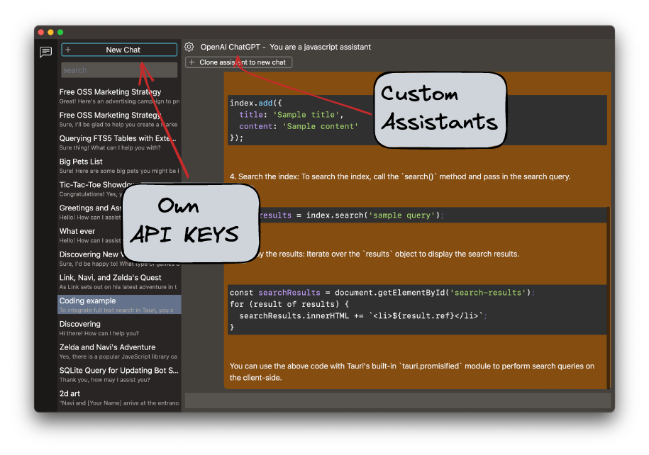

# Delegate  

Delegate is a free and open-source desktop application that allows the user to run chatGPT as a dekstop application.

## Installation  

Go to <https://github.com/EzzatOmar/delegate/releases/latest> and download the build for your operating system.

## Usage  

1. Once the application is running, you can type in a prompt and hit enter to generate a response.  
2. The generated response will be displayed on the screen.  

## Feedback

If you have any feedback, please join our github discussion <https://github.com/EzzatOmar/delegate/discussions/>  