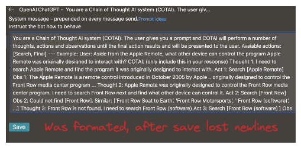
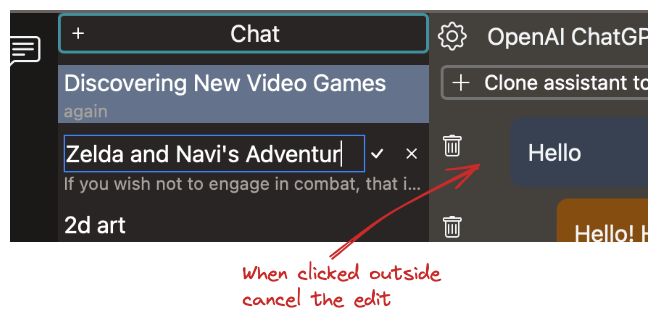

# BUGS / REFACTOR

- [ ] fix tauri warning  
  
- [ ]  
  
- [ ] as we use now xState we should rename all solid realated storges to stores or signals

# Release v.0.1.5  

# TODO

- [ ] implement chain of thoughts with minds - try out
- [ ] implement new tabs (agent, tools)
- [ ] upload document
- [ ] prompt library
- [ ] add discussion link <https://github.com/EzzatOmar/delegate/discussions>
- [ ] save text as tiptap json
- [ ] add code formater in text input
- [ ] write architecture docs
- [ ] auto title naming: add setting to disable
- [ ] auto title naming: add button to regenerate
- [ ] ci pipeling - fail when release already exists
- [ ] render tables  <https://tiptap.dev/api/nodes/table>
- [ ] keep newlines in system message  
 
- [ ] sidebar item, on click outside exit edit mode of ChatListItem
  - 
- [ ] parse GlobalError in FE, handle
- [ ] loading button state
  - 
- [ ] render lists  
  - 

# Roadmap

- [ ] add system tray
- [ ] website + download
- [ ] other opanai text apis
- [ ] other chat bot apis
- [ ] agent system -> glue many bots into one agent
- [ ] locally run delegate bot
- [ ] prompt template
- [ ] rewrite chat panel, use richtexteditor like tiptap
- [ ] llama alpaca
- [ ] text -> image
- [ ] plugin system

# Other

- [ ] reqwest lib might be included as tauri feature `reqwest-client`, check if that's better
