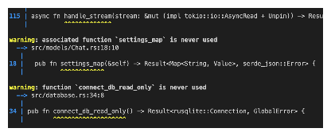
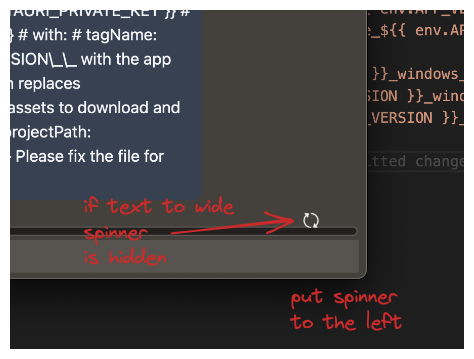
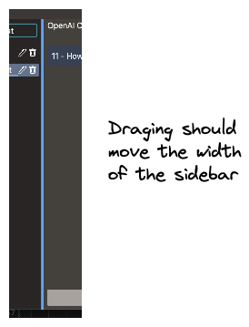
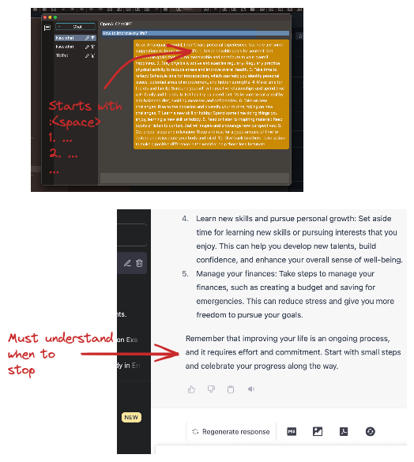

# BUGS

- [ ] fix tauri warning  
  
- [ ]  
  

# TODO

- [ ] test install.json, update trigger
- [ ] add update function
- [ ] add code formater in left messages
- [ ] add code formater in text input
- [ ] include text streaming
- [ ] update readme
- [ ] auto name chate name in chat gpt, add setting to disable
- [ ] save text as tiptap json
- [ ] make context window variable
 - [ ] add tokenizer https://www.npmjs.com/package/@dqbd/tiktoken?activeTab=readme#vite
- [ ] loading button state
  
- [ ] write readme
- [ ] write architecture docs
- [ ] parse GlobalError in FE, handle
- [ ] sidebar-width  
  

# Features

- [ ] render lists  
  
- [ ] add system tray
- [ ] create multiple openai completion bot by model (ada, babbage, davinci, etc)

# Roadmap - v0.1

- [ ] cross platform builds - https://tauri.app/v1/guides/building/cross-platform
- [ ] setup updater - must have some kind of server to host versions
- [ ] frontend + editor
- [ ] website + download

# Roadmap - v.0.1.x

- [ ] other opanai text apis
- [ ] other chat bot apis
- [ ] agent system -> glue many bots into one agent
- [ ] locally run delegate bot
- [ ] prompt template
- [ ] rewrite chat panel, use richtexteditor like tiptap

# Other

- [ ] reqwest lib might be included as tauri feature `reqwest-client`, check if that's better
