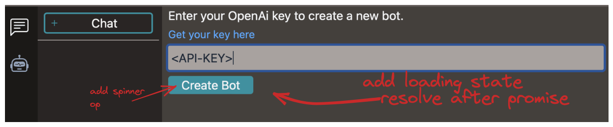

# BUGS

- [ ] fix tauri warning  
  
- [ ]  
  

# Release v.0.1.1  

# TODO

- [ ] update build:json.install - read from changelog, update notes key
  - [ ] render notes in bot detail on update dialog
- [ ] sidebar-width remove
- [ ] clone bot: perseve system bot
- [ ] auto name chat name in chat gpt, add setting to disable
- [ ] make context window variable
  - [ ] add tokenizer <https://www.npmjs.com/package/@dqbd/tiktoken?activeTab=readme#vite/>
- [ ] update readme
- [ ] save text as tiptap json
- [ ] add code formater in text input
- [ ] full text search: <https://github.com/lucaong/minisearch/>
- [ ] write architecture docs
- [ ] parse GlobalError in FE, handle
- [ ] loading button state
  - 

# Features

- [ ] render lists  
  
- [ ] add system tray
- [ ] create multiple openai completion bot by model (ada, babbage, davinci, etc)

# Roadmap

- [ ] website + download
- [ ] other opanai text apis
- [ ] other chat bot apis
- [ ] agent system -> glue many bots into one agent
- [ ] locally run delegate bot
- [ ] prompt template
- [ ] rewrite chat panel, use richtexteditor like tiptap
- [ ] llama alpaca
- [ ] text -> image
- [ ] plugin system

# Other

- [ ] reqwest lib might be included as tauri feature `reqwest-client`, check if that's better
